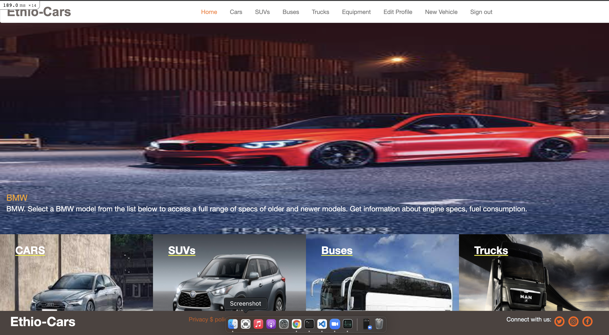
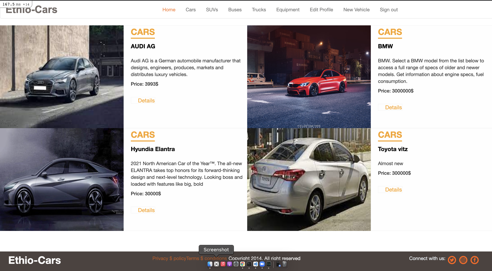

# Ruby on Rials Capstone Project

# Project Name: Ethio-cars

Ethio-cars is built by taking lifestyle webpage as reference. I used the layout from the lifestyle webpage but the content is different. Ethio-cars webpage is an online car selling platform. clients easily upload to the site the vehicle they want to sell with images and detailed vehicle conditions. and the buyer visits the page and selects the car they want to buy. and also the platform gives the visitor to like the vehicle they interested in. the vehicle that has most likes appear on the top of the homepage.

## Screenshots





## Live Demo

[Ethio-cars](https://quiet-gorge-87738.herokuapp.com/)

## Vedio
[Vedio-link](https://www.loom.com/share/836eb2de147a45fe8002b19a97cb2de8)

## Getting Started

To get a local copy up and running follow these simple example steps.

### Prerequisites

Ruby: 2.7.2
Rails: 5.2.3
Postgres: >=9.5

### Run locally

1. git clone `git@github.com:Addis0943/Ethiopian_cars.git`

### Setup

Install gems with:

```
bundle install
```

Setup database with:

```
   rails db:create
   rails db:migrate
```

### Usage

Start server with:

```
    rails server
```

Open `http://localhost:3000/` in your browser.

### Run tests

```
    rpsec --format documentation
```

## ✒️ Author <a name = "author"></a>

👤 **Addis Belete**

- Github: [@Addis0943](https://github.com/Addis0943)
- Linkedin: [Addid Belete](https://www.linkedin.com/in/addis-belete-134b98191/)
